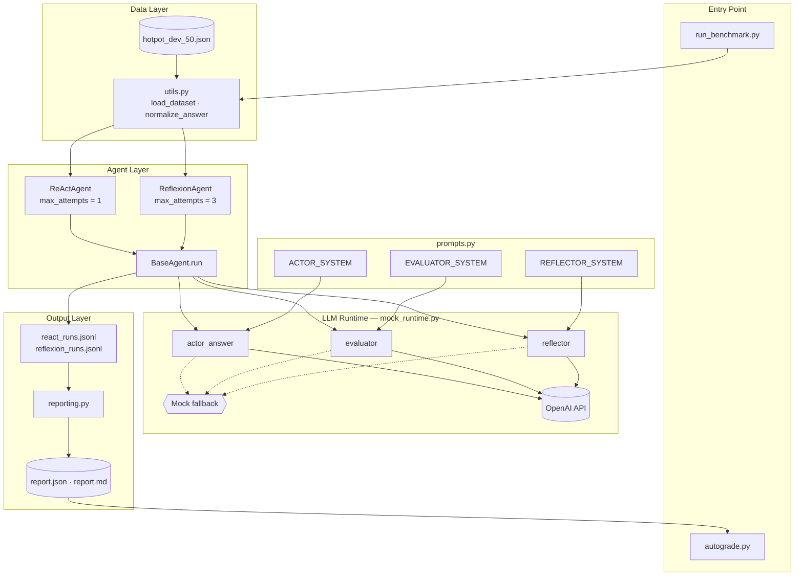
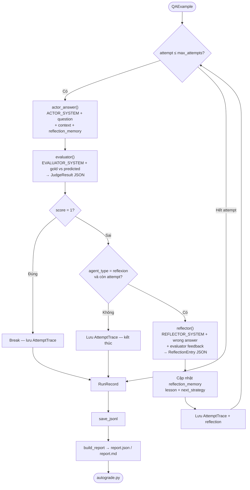
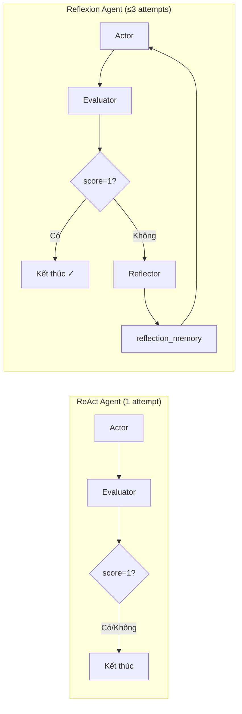

# Lab 16 — Reflexion Agent

## Thông tin sinh viên


|                  |                  |
| ---------------- | ---------------- |
| **Họ và tên**    | Nguyễn Văn Chung |
| **Mã sinh viên** | 2A202600647      |
| **Lớp / Nhóm**   | C401 - Track 3   |
| **Ngày nộp bài** | 18/06/2026       |


---

## Tổng quan

Bài lab triển khai **Reflexion Agent** — kiến trúc agent có khả năng **tự phản chiếu (self-reflection)** để cải thiện câu trả lời qua nhiều lần thử.

Pipeline gồm 3 vai trò LLM:

1. **Actor** — đọc context + reflection memory → trả lời câu hỏi multi-hop
2. **Evaluator** — chấm điểm 0/1, trả về JSON có `reason`, `missing_evidence`, `spurious_claims`
3. **Reflector** — phân tích lỗi → đề xuất `lesson` và `next_strategy` cho lần thử tiếp theo

So sánh hai agent:


| Agent         | Mô tả                                                    |
| ------------- | -------------------------------------------------------- |
| **ReAct**     | 1 attempt, không reflection                              |
| **Reflexion** | Tối đa 3 attempts, có reflection memory giữa các lần thử |


**LLM sử dụng:** OpenAI API (`gpt-4o-mini` mặc định, cấu hình qua `.env`)

---

## Kết quả benchmark (OpenAI)

Chạy trên `data/hotpot_dev_50.json` (50 câu × 2 agents = **100 records**).


| Metric             | ReAct | Reflexion | Delta     |
| ------------------ | ----- | --------- | --------- |
| **EM (accuracy)**  | 0.72  | **0.90**  | **+0.18** |
| Avg attempts       | 1.00  | 1.44      | +0.44     |
| Avg token estimate | 3,288 | 5,675     | +2,387    |
| Avg latency (ms)   | 3,924 | 7,382     | +3,459    |


**Nhận xét ngắn:** Reflexion cải thiện EM **+18%** so với ReAct nhờ reflection memory, đổi lại tốn thêm token và latency. Reflexion giảm `wrong_final_answer` từ 13 → 5 câu so với ReAct.

**Output:** `outputs/openai_run/report.json`, `report.md`

**Autograde:** `100/100` (Core 80/80 + Bonus 20/20)

---

## Cài đặt

### Yêu cầu

- Python 3.10+
- OpenAI API key

### Bước 1 — Clone & cài dependencies

```bash
python -m venv .venv

# Linux / macOS
source .venv/bin/activate

# Windows (PowerShell)
.venv\Scripts\Activate.ps1

pip install -r requirements.txt
```

### Bước 2 — Cấu hình API key

```bash
cp .env.example .env
```

Chỉnh `.env`:

```env
OPENAI_API_KEY=sk-your-real-key-here
OPENAI_MODEL=gpt-4o-mini
```


| Biến môi trường  | Mô tả                                       |
| ---------------- | ------------------------------------------- |
| `OPENAI_API_KEY` | API key OpenAI (bắt buộc khi chạy LLM thật) |
| `OPENAI_MODEL`   | Model sử dụng (mặc định `gpt-4o-mini`)      |
| `MOCK_MODE=1`    | Bật mock deterministic, không gọi API       |


> Nếu không có API key hoặc key là placeholder (`sk-your-...`), hệ thống tự chuyển sang **mock mode**.

---

## Chạy benchmark

### Chạy mặc định (OpenAI + hotpot_dev_50)

```bash
python run_benchmark.py --dataset data/hotpot_dev_50.json --out-dir outputs/openai_run
```

### Tùy chọn

```bash
python run_benchmark.py \
  --dataset data/hotpot_dev_50.json \
  --out-dir outputs/openai_run \
  --reflexion-attempts 3
```

### Chạy mock (không tốn API)

```bash
# Windows
set MOCK_MODE=1
python run_benchmark.py --out-dir outputs/mock_run

# Linux / macOS
MOCK_MODE=1 python run_benchmark.py --out-dir outputs/mock_run
```

### Chấm điểm tự động

```bash
python autograde.py --report-path outputs/openai_run/report.json
```

### Golden Test Set

File: `data/hotpot_golden.json` (20 câu multi-hop)

```bash
python run_benchmark.py --dataset data/hotpot_golden.json --out-dir outputs/golden_run
python autograde.py --report-path outputs/golden_run/report.json
```

**Kết quả Golden Test (OpenAI):**

| Metric | ReAct | Reflexion | Delta |
|---|---:|---:|---:|
| **EM** | 0.95 | **1.00** | **+0.05** |
| Avg attempts | 1.00 | 1.05 | +0.05 |
| Avg token/câu | 493 | 548 | +55 |
| Avg latency/câu | 2.3s | 2.2s | -0.1s |
| Thời gian chạy (20 câu × 2 agents) | | | **~1.9 phút** |
| Tổng token ước tính | ~9,865 | ~10,958 | **~20,823** |
| Ước tính cost (gpt-4o-mini) | | | **~$0.01** |

**Output:** `outputs/golden_run/report.json`, `report.md`

> Golden set có context ngắn hơn HotpotQA → ít token hơn (~500/câu vs ~3,000–5,000/câu).

---

## Cấu trúc project

```
phase1-track3-lab1-advanced-agent/
├── README.md
├── requirements.txt
├── .env.example              # Mẫu cấu hình API key
├── run_benchmark.py          # Entry point chạy benchmark
├── autograde.py              # Chấm điểm từ report.json
├── data/
│   ├── hotpot_dev_50.json           # 50 câu HotpotQA (benchmark chính)
│   ├── hotpot_golden.json           # 20 câu Golden Test Set
│   └── hotpot_dev_distractor_v1.json # HotpotQA gốc (7405 câu)
├── scripts/
│   └── convert_hotpot_dataset.py    # Convert HotpotQA → format QAExample
├── src/reflexion_lab/
│   ├── schemas.py            # Pydantic models
│   ├── prompts.py            # System prompts Actor / Evaluator / Reflector
│   ├── mock_runtime.py       # OpenAI runtime + mock fallback
│   ├── agents.py             # ReAct + Reflexion loop
│   ├── reporting.py          # Tổng hợp & xuất report
│   └── utils.py              # load_dataset, normalize_answer, save_jsonl
├── tests/
│   └── test_utils.py
└── outputs/
    ├── openai_run/           # Kết quả benchmark chính (50 câu)
    │   ├── report.json
    │   ├── report.md
    │   ├── react_runs.jsonl
    │   └── reflexion_runs.jsonl
    └── golden_run/           # Kết quả Golden Test Set (20 câu)
        ├── report.json
        ├── report.md
        ├── react_runs.jsonl
        └── reflexion_runs.jsonl
```

---

## Kiến trúc & luồng xử lý

### Sơ đồ kiến trúc hệ thống



### Sơ đồ luồng xử lý Reflexion Agent



### So sánh ReAct vs Reflexion



**Lưu ý về `num_records`:** 100 records = 50 câu hỏi × 2 agents (ReAct + Reflexion), không phải 100 câu hỏi riêng lẻ.

---

## Các phần đã triển khai

### Bước 2 — Hoàn thiện scaffold


| File         | Nội dung                                                                                                                                |
| ------------ | --------------------------------------------------------------------------------------------------------------------------------------- |
| `schemas.py` | `JudgeResult` (score, reason, missing_evidence, spurious_claims), `ReflectionEntry` (attempt_id, failure_reason, lesson, next_strategy) |
| `agents.py`  | Reflexion loop: gọi `reflector()`, cập nhật `reflection_memory`, gắn reflection vào trace                                               |
| `prompts.py` | System prompts cho Actor, Evaluator (JSON), Reflector (JSON)                                                                            |


### Bước 3 — OpenAI runtime (`mock_runtime.py`)


| Hàm              | Input                                  | Output                           |
| ---------------- | -------------------------------------- | -------------------------------- |
| `actor_answer()` | question, context, reflection_memory   | `(answer, CallMetrics)`          |
| `evaluator()`    | question, gold, predicted, context     | `(JudgeResult, CallMetrics)`     |
| `reflector()`    | question, wrong_answer, judge feedback | `(ReflectionEntry, CallMetrics)` |


### Bước 4 — Dataset

- `scripts/convert_hotpot_dataset.py` — convert từ HotpotQA sang format `QAExample`
- `data/hotpot_dev_50.json` — 50 câu multi-hop đa dạng (comparison, bridge, yes/no, …)

```bash
# Tạo lại dataset (tùy chọn, ví dụ 100 câu)
python scripts/convert_hotpot_dataset.py --limit 100 --output data/hotpot_dev_100.json
```

**Format `QAExample`:**

```json
{
  "qid": "unique_id",
  "difficulty": "easy | medium | hard",
  "question": "Câu hỏi multi-hop...",
  "gold_answer": "Đáp án đúng",
  "context": [
    {"title": "Nguồn 1", "text": "Nội dung đoạn văn..."},
    {"title": "Nguồn 2", "text": "Nội dung đoạn văn..."}
  ]
}
```

### Bước 5 — Token & latency thật

- `agents.py` lấy `token_estimate` và `latency_ms` từ `CallMetrics` trả về sau mỗi LLM call
- OpenAI mode: `usage.total_tokens` + `time.perf_counter()`
- Tổng hợp per-attempt và per-run trong `RunRecord`

---

## Extensions đã triển khai


| Extension                   | Mô tả                                    | Trạng thái |
| --------------------------- | ---------------------------------------- | ---------- |
| `structured_evaluator`      | Evaluator trả JSON → parse `JudgeResult` | ✅          |
| `reflection_memory`         | Lưu lesson/strategy qua các attempt      | ✅          |
| `benchmark_report_json`     | Xuất `report.json` + `report.md`         | ✅          |
| `mock_mode_for_autograding` | Fallback mock khi không có API key       | ✅          |
| `adaptive_max_attempts`     | Tự điều chỉnh số attempt                 | ❌          |
| `memory_compression`        | Nén reflection memory                    | ❌          |
| `mini_lats_branching`       | Branching search                         | ❌          |
| `plan_then_execute`         | Plan-then-execute pattern                | ❌          |


---

## Tiêu chí chấm điểm (Rubric)


| Phần                    | Điểm    | Yêu cầu                                                                                    | Kết quả                     |
| ----------------------- | ------- | ------------------------------------------------------------------------------------------ | --------------------------- |
| **Core Flow**           | **80**  |                                                                                            | **80/80**                   |
| Schema completeness     | 30      | Report đủ keys: `meta`, `summary`, `failure_modes`, `examples`, `extensions`, `discussion` | ✅                           |
| Experiment completeness | 30      | ReAct + Reflexion, ≥100 records, ≥20 examples chi tiết                                     | ✅ 100 records, 100 examples |
| Analysis depth          | 20      | ≥3 failure modes, discussion ≥250 ký tự                                                    | ✅                           |
| **Bonus**               | **20**  | ≥1 extension (10đ/cái, tối đa 20đ)                                                         | **20/20** (3 extensions)    |
| **Tổng autograde**      | **100** |                                                                                            | **100/100**                 |


> Autograde tự động. Giảng viên có thể review thêm: chất lượng code, token logic, chiều sâu phân tích.

---

## Golden Test Set (Bonus cuối ngày)

Trong **15 phút cuối** buổi lab, giảng viên phát **Golden Test Set** — dữ liệu test hoàn toàn mới.

- Chạy agent trên file đó và nộp kết quả
- Dùng để **xếp hạng** giữa các nhóm (tách với autograde rubric)
- Agent đã sẵn sàng: chỉ cần đổi `--dataset` sang file golden

---

## Hướng dẫn nộp bài


| #   | Nội dung nộp         | Đường dẫn                                                     |
| --- | -------------------- | ------------------------------------------------------------- |
| 1   | Source code          | Toàn bộ repo                                                  |
| 2   | Report benchmark     | `outputs/openai_run/report.json`                              |
| 3   | Report markdown      | `outputs/openai_run/report.md`                                |
| 4   | Run logs (tùy chọn)  | `outputs/openai_run/react_runs.jsonl`, `reflexion_runs.jsonl` |
| 5   | Golden Test (khi có) | `outputs/golden_run/report.json`                              |


**Không commit file `.env`** (chứa API key).

---

## Thành phần mã nguồn


| File                                | Mô tả                                                                       |
| ----------------------------------- | --------------------------------------------------------------------------- |
| `src/reflexion_lab/schemas.py`      | Kiểu dữ liệu: `QAExample`, `RunRecord`, `JudgeResult`, `ReflectionEntry`, … |
| `src/reflexion_lab/prompts.py`      | System prompts Actor, Evaluator, Reflector                                  |
| `src/reflexion_lab/mock_runtime.py` | OpenAI runtime + mock fallback                                              |
| `src/reflexion_lab/agents.py`       | Vòng lặp ReAct + Reflexion Agent                                            |
| `src/reflexion_lab/reporting.py`    | Tổng hợp metrics, failure modes, xuất report                                |
| `src/reflexion_lab/utils.py`        | `load_dataset`, `normalize_answer`, `save_jsonl`                            |
| `run_benchmark.py`                  | Script chạy benchmark                                                       |
| `autograde.py`                      | Chấm điểm tự động                                                           |
| `scripts/convert_hotpot_dataset.py` | Convert HotpotQA → QAExample                                                |
| `data/hotpot_dev_50.json`           | Dataset benchmark chính (50 câu)                                            |


